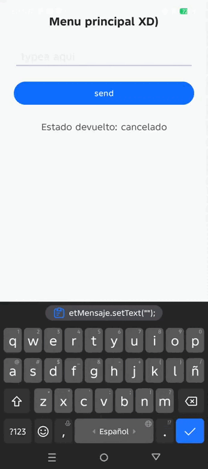

# 📄 Proyecto: Práctica de Actividades e Interacción en Android

---

### 👤 Datos de Identificación
* **Estudiante:** Elvis Guerra
* **Proyecto:** Comunicación Bidireccional entre Actividades
* **Tecnologías:** Java | XML | Android SDK
* **Desarrollo de Aplicaciones Moviles** Actividad 2

---

##  Descripción General
Aplicación nativa de Android desarrollada en **Java** y **XML** para demostrar la navegación, la transferencia de datos y el manejo de respuestas entre pantallas (*Activities*) utilizando `Intents` y el contrato moderno `ActivityResultLauncher`.

---

## 📌 Explicación Técnica y Arquitectura

### 1. Pantalla Principal (MainActivity.java)
En la primera pantalla implementamos el flujo de envío y la escucha activa de la respuesta:
- **Manejo de Callback:** Implementamos una función de callback mediante `ActivityResultLauncher`. Esta función no se ejecuta de inmediato; funciona bajo el principio de *"te dejo esta función pero ejecútala únicamente cuando la Pantalla 2 termine su proceso y cumpla el criterio de retorno"*.
- **Registro y Contrato:** Notificamos al ciclo de vida de Android que la actividad principal queda a la espera de un resultado (`registerForActivityResult`), estableciendo mediante el contrato `StartActivityForResult()` las acciones esperadas al volver.
- **Limpieza de Interfaz:** Al detonar el envío del mensaje hacia la segunda pantalla, el cuadro de texto (`EditText`) borra automáticamente su contenido para quedar preparado para una nueva interacción.

### 2. Segunda Pantalla (Pantalla2.java)
La segunda actividad cumple tres tareas específicas:
1. **Recepción:** Recibe y desempaqueta los datos enviados desde `MainActivity` mediante un `Intent`.
2. **Visualización:** Muestra el mensaje recibido dentro de la interfaz gráfica.
3. **Respuesta y Retorno:** Captura la decisión del usuario (vía botones de "Recibido" o "Cancelar"), empaqueta el estado devuelto y finaliza la pantalla con `finish()`, entregando la respuesta a `MainActivity`.

### 3. Interfaz Gráfica (activity_main.xml y activity_pantalla2.xml)
Los archivos XML se encargan exclusivamente del diseño visual (separando la lógica del código Java):
- Organizan la estructura de la pantalla mediante contenedores `LinearLayout`.
- Definen los componentes visuales (`Button`, `EditText`, `TextView`).
- Asignan identificadores únicos (`android:id`) que permiten al código Java localizar e interactuar con cada elemento gráfico.

---

## 📂 Estructura del Proyecto

app/
└── src/
└── main/
├── java/com/example/mfappm/
│    ├── MainActivity.java
│    └── Pantalla2.java
└── res/
└── layout/
├── activity_main.xml
└── activity_pantalla2.xml

---

## 📸 Evidencias de Funcionamiento (Pruebas) 

### 1. Pantalla Principal (Ingreso de Mensaje)
Muestra la primera interfaz con el campo de texto y el botón de envío.

### 2. Segunda Pantalla (Recepción del Mensaje)
Muestra el mensaje transferido con éxito a través del Intent y los botones de respuesta.

### 3. Retorno y Actualización de Estado en MainActivity
Muestra el estado devuelto ("recibido" o "cancelado") en la pantalla de origen tras presionar la acción en Pantalla 2.

### 4. Configuracion de cel y Entorno
Muestra la conexion correcta de el celular el cual utilizaremos como dispositiva para probar la app

### 5. Pruebas adicionales

!

### 6. Pruebas adicionales 2

